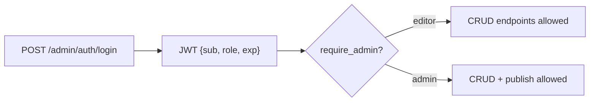

# Authentication & Authorization

## Model

- **AuthN:** email + password → signed **JWT** (Bearer). Claims: `sub` (user id), `role`
  (`editor` | `admin`), `exp`.
- **AuthZ:** role-based; enforced by FastAPI dependencies, not inline checks.



## Role matrix

| Endpoint group | editor | admin |
|---|---|---|
| Shows / seasons / episodes CRUD | ✅ | ✅ |
| Artwork upload/delete | ✅ | ✅ |
| Validation report | ✅ | ✅ |
| Publish | ❌ 403 | ✅ |
| Publish run history | ❌ 403 | ✅ |

## Enforcement pattern

```python
# backend/app/core/dependencies.py (shape)
def get_current_user(token: str = Depends(oauth2_scheme)) -> User:
    payload = decode_jwt(token)          # raises 401 on failure
    return user_repo.get(payload["sub"])

def require_admin(user: User = Depends(get_current_user)) -> User:
    if user.role != "admin":
        raise HTTPException(403, "insufficient_permissions")
    return user
```

The `require_admin` dependency is attached to publish/run-history routes at registration time, so a
non-admin request is rejected **before** the handler body executes — satisfying "actually enforced,
not just declared".

## Testing roles

- `test_login_returns_token` — happy path.
- `test_editor_cannot_publish` — editor token → 403 on `/admin/catalog/publish`.
- `test_admin_can_publish` — admin token → 200.
- `test_expired_token_rejected` — 401.
