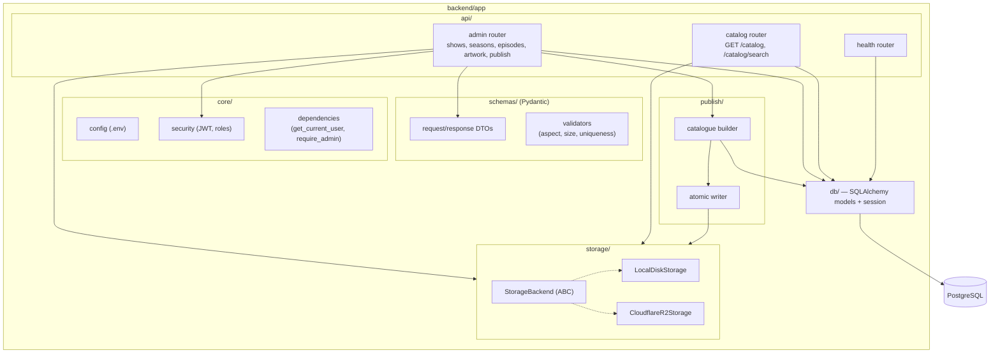
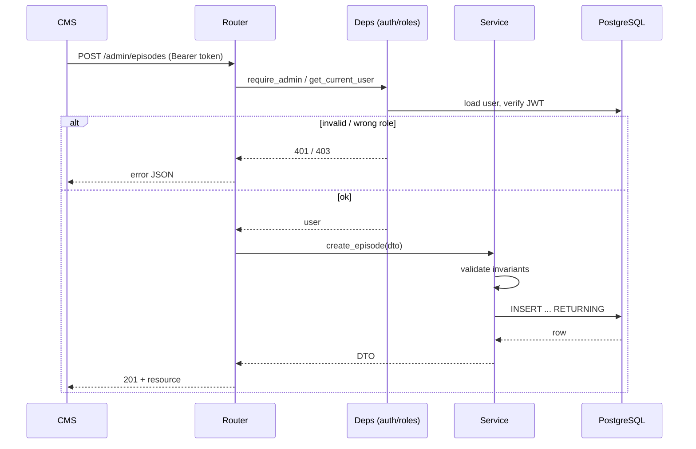

# Backend Architecture

## Component diagram

## Layering rules

1. **Routers** never touch SQL directly — they call services/repositories and return Pydantic DTOs.
2. **Validation** lives in Pydantic schemas + a dedicated service; it is *never* client-side-only.
3. **Storage** is accessed only through `StorageBackend`; no `open()`/`boto3` in routers.
4. **Roles** are enforced by FastAPI dependencies (`require_admin`) on every admin endpoint — not
   merely checked inside handlers.
5. **Transactions** are explicit: publish runs in one transaction to read + record, then writes the
   catalogue atomically *after* commit.

## Module responsibilities

| Module | Responsibility |
|---|---|
| `api/admin` | Auth, CRUD for shows/seasons/episodes, artwork upload, publish trigger, run history, validation report |
| `api/catalog` | `GET /catalog`, `GET /catalog/search` — read-only, no auth |
| `api/health` | Liveness/readiness probe for orchestration + alerting |
| `schemas/` | Pydantic v2 models; embed invariant validators (aspect ratio, size, enum membership) |
| `core/config` | Env-driven settings (pydantic-settings) |
| `core/security` | Password hashing (argon2/bcrypt), JWT sign/verify, role extraction |
| `core/dependencies` | `get_current_user`, `require_admin`, `get_db` |
| `publish/builder` | Query published content, collapse content_groups, group by section, deterministic sort |
| `publish/atomic` | Write to temp key → atomic rename / conditional put; return final object key |
| `storage/` | `StorageBackend` + implementations |
| `db/` | SQLAlchemy models, session factory, engine |

## Request lifecycle (admin write)

