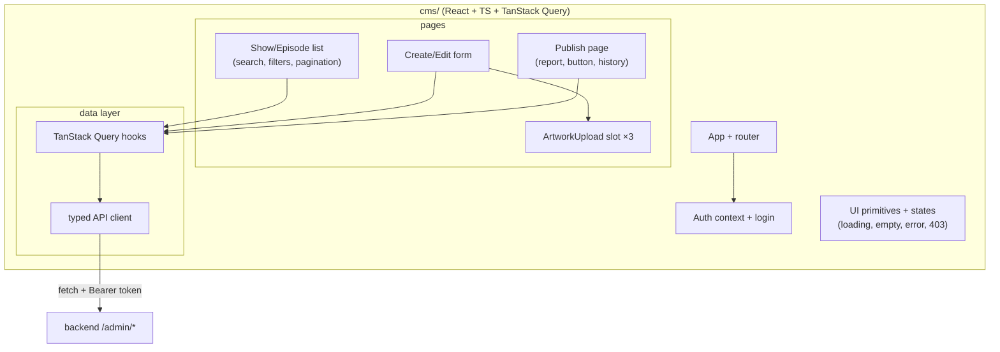
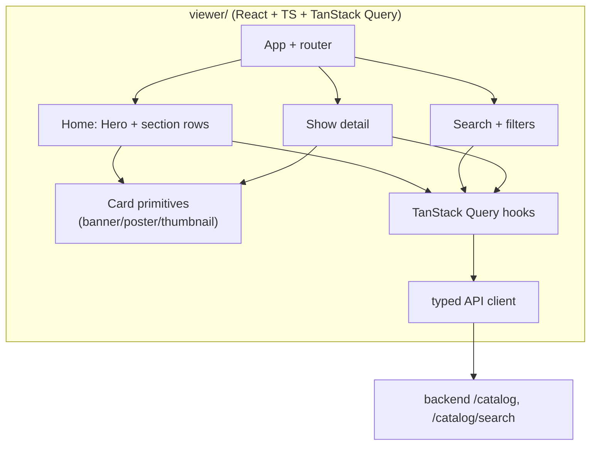

# Frontend Architecture

Two separate React apps — the **CMS** (internal, authenticated) and the **Viewer** (public,
read-only). They share no state and only meet at the published catalogue.

## CMS component diagram

## Viewer component diagram

## Artwork per surface (viewer rule)

| Surface | Artwork kind | Rationale |
|---|---|---|
| Featured hero | `banner` (16:9) | Wide cinematic hero |
| Section rows | `poster` (2:3) | Vertical cards in a row |
| Episode lists | `thumbnail` (16:9) | Small landscape tiles |

## State handling matrix (both apps)

| State | CMS behaviour | Viewer behaviour |
|---|---|---|
| Loading | Skeleton rows / spinners | Skeleton + lazy image with blur-up placeholder |
| Empty | "No shows match — clear filters" | Friendly empty state with clear CTA |
| Error | Inline, human-readable (editor can act) | Retry button + offline hint |
| Permission denied | 403 screen, hide admin-only actions | n/a (public) |
| Slow images | Preview spinner while uploading | Blur-up / background color placeholder, lazy loading |

## Shared conventions

- TanStack Query for server state; local component state only for transient UI.
- Typed API client generated from the OpenAPI contract (see [`api/`](../api/)).
- No business logic duplicated between CMS and Viewer; the API is the single source of truth.
