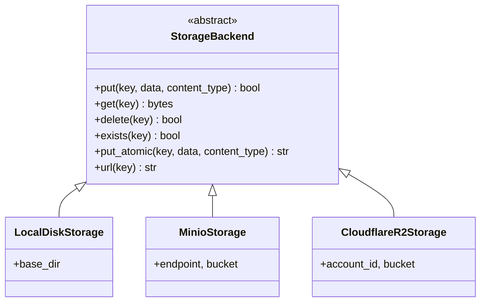

# Storage Abstraction

Artwork and the published catalogue are stored behind a single interface so that moving from local
disk (dev) to MinIO (staging) to **Cloudflare R2** (production) is a **one-class change**.

## Interface



```python
# backend/app/storage/base.py (shape)
from abc import ABC, abstractmethod
from typing import BinaryIO

class StorageBackend(ABC):
    @abstractmethod
    def put(self, key: str, data: bytes, content_type: str) -> None: ...
    @abstractmethod
    def get(self, key: str) -> bytes: ...
    @abstractmethod
    def delete(self, key: str) -> None: ...
    @abstractmethod
    def exists(self, key: str) -> bool: ...
    @abstractmethod
    def put_atomic(self, key: str, data: bytes, content_type: str) -> None:
        """Write `data` so a concurrent reader never sees a partial object."""
    @abstractmethod
    def url(self, key: str) -> str: ...
```

## Object key conventions

```
artwork/{kind}/{uuid}.{ext}        # poster/banner/thumbnail
catalogue/catalogue.json           # live catalogue (stable key)
catalogue/catalogue-{version}.json # versioned copy (rollback/audit)
```

## Atomicity per backend

| Backend | Atomic write mechanism |
|---|---|
| LocalDisk / MinIO | write to `{key}.tmp` → `os.replace`/rename (atomic on same filesystem) |
| Cloudflare R2 | write temp key → server-side copy/rename, or a conditional `If-Unmodified-Since` put |

## What changes to go from local disk → Cloudflare R2

1. Implement `CloudflareR2Storage` using `boto3` with the S3-compatible R2 endpoint.
2. Set `STORAGE_BACKEND=r2` plus `R2_ACCESS_KEY_ID`, `R2_SECRET_ACCESS_KEY`, `R2_ACCOUNT_ID`,
   `R2_BUCKET` in `.env`.
3. Nothing else changes — routers, publish job, and tests continue to depend only on `StorageBackend`.

This is the entire point of the abstraction: **no business code knows where bytes live.**
