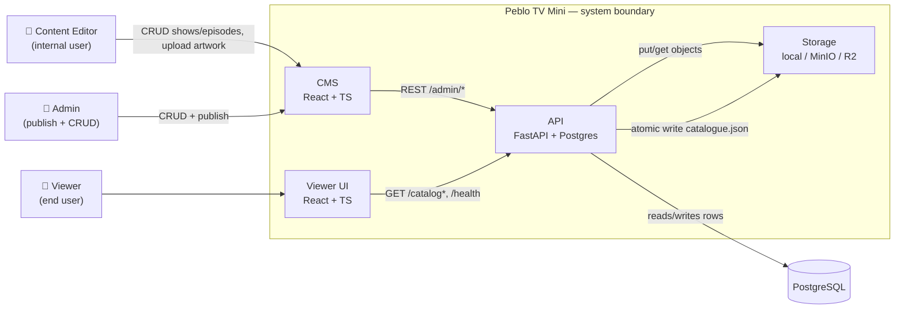
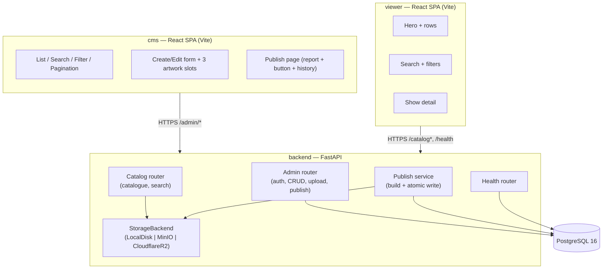

# System Architecture

## C4 — Context (Level 1)

**Actors**
- **Editor** — content team; can create/edit shows, seasons, episodes, upload artwork.
- **Admin** — editor + publish authority.
- **Viewer** — a child browsing shows; anonymous, read-only.

## C4 — Containers (Level 2)

## Technology stack

| Concern | Choice | Rationale |
|---|---|---|
| API | Python 3.12, FastAPI | Async, typed, auto OpenAPI; required by challenge |
| ORM | SQLAlchemy 2.0 + Alembic | Mature migrations; explicit transactions for atomic publish |
| Validation | Pydantic v2 | Shares types with FastAPI; centralises rules |
| Database | PostgreSQL 16 | Required; JSONB for publish counts, real FK constraints |
| Storage | `StorageBackend` ABC → `LocalDiskStorage`, `CloudflareR2Storage` (boto3) | One-class swap |
| CMS / Viewer | React 18 + TypeScript + Vite | Required |
| Server state | TanStack Query | Caching, retries, optimistic states |
| Auth | JWT (Bearer) with role claim | Stateless, easy to test/enforce |
| Container | Docker + docker-compose | Part D requirement |
| CI | GitHub Actions | Part D requirement |
| Tests | pytest (backend), Vitest + Testing Library (frontend) | Standard |

## Key design decisions (see [`decisions/`](../decisions/) for full ADRs)

1. **Serve a pre-published catalogue file** rather than querying the DB per viewer request
   → fast, cacheable, decouples read path from the CMS. Trade-off: eventual consistency between a
   publish and what viewers see (acceptable — publishes are explicit).
2. **Atomic publish** via temp-file + rename (local/MinIO) or object-storage conditional put (R2).
3. **Collapse `content_group` at publish time** — the DB stores one row per language variant; the
   catalogue materialises the `languages` list.
4. **Single `StorageBackend` interface** so dev (local disk) and prod (R2) are one class apart.
