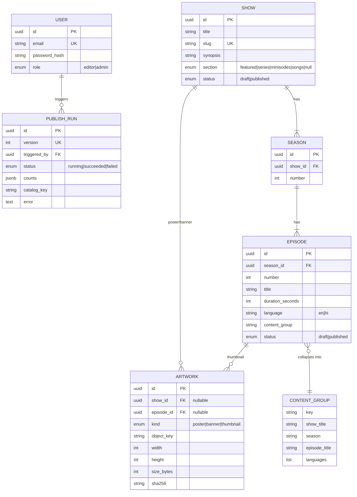
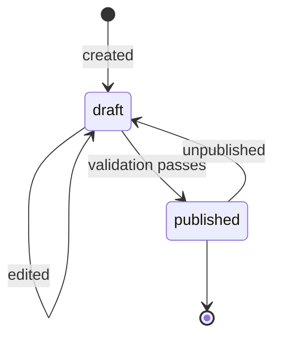

# Domain Model

## Entities and relationships

## Vocabulary

| Term | Meaning | Example |
|---|---|---|
| **Show** | A title / series | `Moti's Many Lives` |
| **Slug** | URL-safe unique id for a show | `motis-many-lives` |
| **Season** | Numbered grouping under a show | Season 1 |
| **Season 0** | Reserved for trailers; hidden as a normal season in the viewer | — |
| **Episode** | A single playable unit within a season | `s01e01 The Lost Kite` |
| **Language** | Audio language of an episode | `en`, `hi` |
| **content_group** | Shared key across language variants of the *same* episode | `motis-many-lives-s01e01` |
| **Section** | Top-level browse row | `featured`, `series`, `minisodes`, `songs` |
| **Category** | Editorial tag (a show has many) | `adventure`, `music` |
| **Artwork** | Validated image in one of three kinds | `poster`, `banner`, `thumbnail` |
| **Status** | Lifecycle of a show/episode | `draft`, `published` |
| **Publish run** | One execution of the catalogue build job | version 42, succeeded |
| **Catalogue** | The published JSON file the viewer reads | `catalogue.json` |

## Business invariants (must hold always)

1. **`(content_group, language)` is unique** — you cannot have two `hi` episodes for the same
   content group.
2. **An episode cannot be `published`** without artwork **and** a duration.
3. **A published show must have a `section`** (one of the four allowed values).
4. **Season 0 is trailers only** — never rendered as a normal season in the viewer.
5. **`content_group` variants collapse** into one catalogue entry with a `languages` list.
6. **Only `published` shows/episodes** appear in the catalogue.
7. **The catalogue is written atomically** — a reader never observes a half-written file.
8. **A publish run is always recorded** (who, when, counts, outcome), whether it succeeds or fails.

## Lifecycle

Publishing a *show* requires a `section`; publishing an *episode* requires artwork + duration.
See [`diagrams/state-diagrams.md`](../diagrams/state-diagrams.md) for the full state machines.
