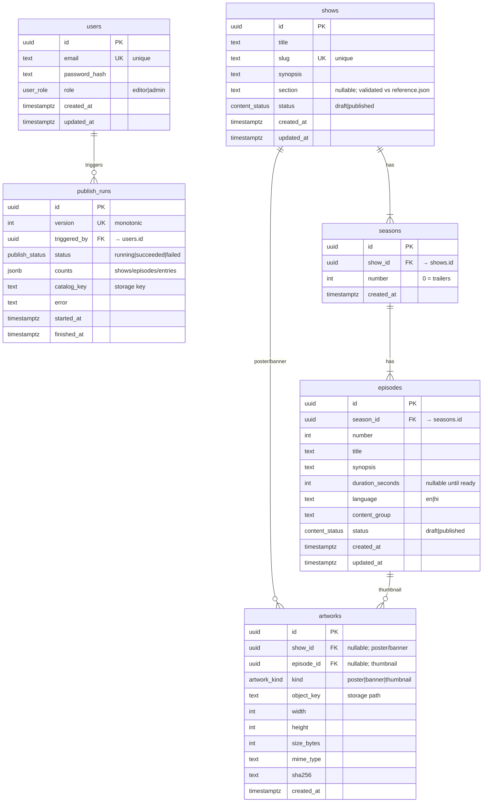

# ER Diagram

## Relationship notes

- **shows 1—N seasons**: a season belongs to exactly one show.
- **seasons 1—N episodes**: an episode belongs to exactly one season (and thus one show).
- **artworks**: polymorphic-ish — exactly one of `show_id`/`episode_id` is set (enforced by a CHECK),
  so `poster`/`banner` hang off a show and `thumbnail` off an episode.
- **content_group**: *not* a physical table in v1 — it's a logical grouping key on `episodes` that
  the publish job collapses into a `languages` list. (It appears in the domain diagram for clarity.)
- **publish_runs → users**: every run records who triggered it.
