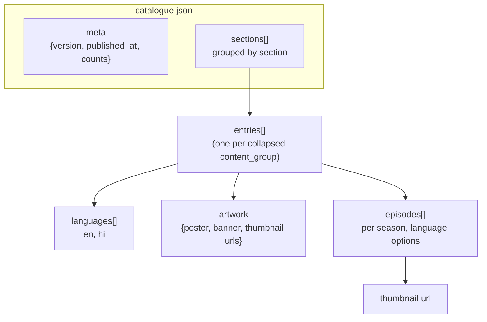

# Catalogue JSON Shape

The published `catalogue.json` is the contract between the API and the Viewer. This is the shape the
Viewer renders from.



## Example (collapsed entry)

```json
{
  "meta": {
    "version": 42,
    "published_at": "2026-08-15T10:00:00Z",
    "counts": { "shows": 7, "episodes": 90, "entries": 82 }
  },
  "sections": [
    {
      "name": "featured",
      "shows": [
        {
          "slug": "motis-many-lives",
          "title": "Moti's Many Lives",
          "synopsis": "Moti the dog is reborn across India...",
          "categories": ["adventure", "india", "friendship"],
          "artwork": {
            "poster": "https://.../artwork/poster/xxx.jpg",
            "banner": "https://.../artwork/banner/xxx.jpg"
          },
          "seasons": [
            {
              "number": 1,
              "episodes": [
                {
                  "content_group": "motis-many-lives-s01e01",
                  "title": "The Lost Kite",
                  "languages": ["en", "hi"],
                  "duration_seconds": 510,
                  "thumbnail": "https://.../artwork/thumbnail/xxx.jpg"
                }
              ]
            }
          ]
        }
      ]
    }
  ]
}
```

## Deterministic ordering rules

1. Sections in the order defined by `reference.json` (`featured`, `series`, `minisodes`, `songs`).
2. Shows sorted by `slug` (stable, not insertion order).
3. Seasons sorted by `number` (Season 0 excluded from the visible list).
4. Episodes sorted by `number`.
5. `languages` sorted lexicographically.

## Collapse rule

Episodes sharing a `content_group` are merged into **one** entry whose `languages` array lists every
variant (e.g. `["en","hi"]`). Artwork and title come from the canonical (English) variant; duration
is per-variant where they differ.
