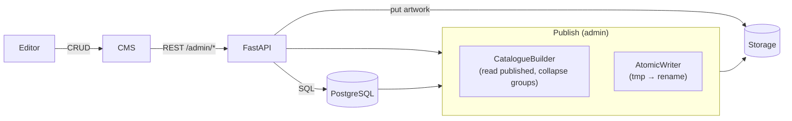
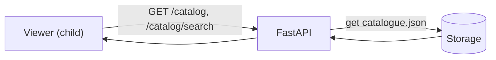
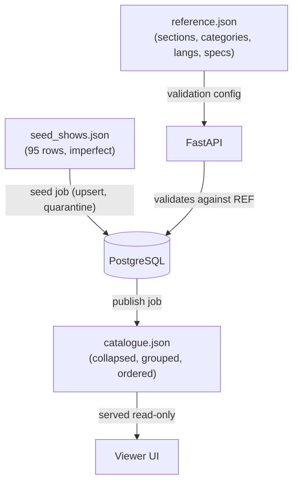

# Data Flow

## Write path (CMS → storage)

## Read path (storage → viewer)

## Materialised data lineage

## Why the read path is decoupled

- The viewer never hits `admin` endpoints and never queries the DB directly.
- Publishing is a **materialisation** step: the DB is the source of truth for the CMS; the catalogue
  file is the source of truth for the viewer. This keeps the read path fast, cacheable, and isolated
  from CMS load and schema churn.
