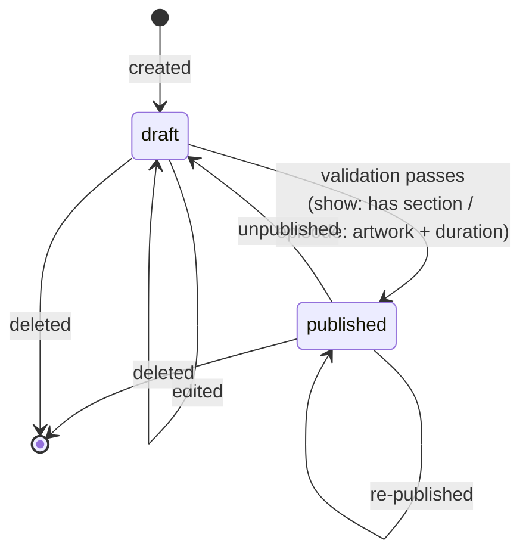
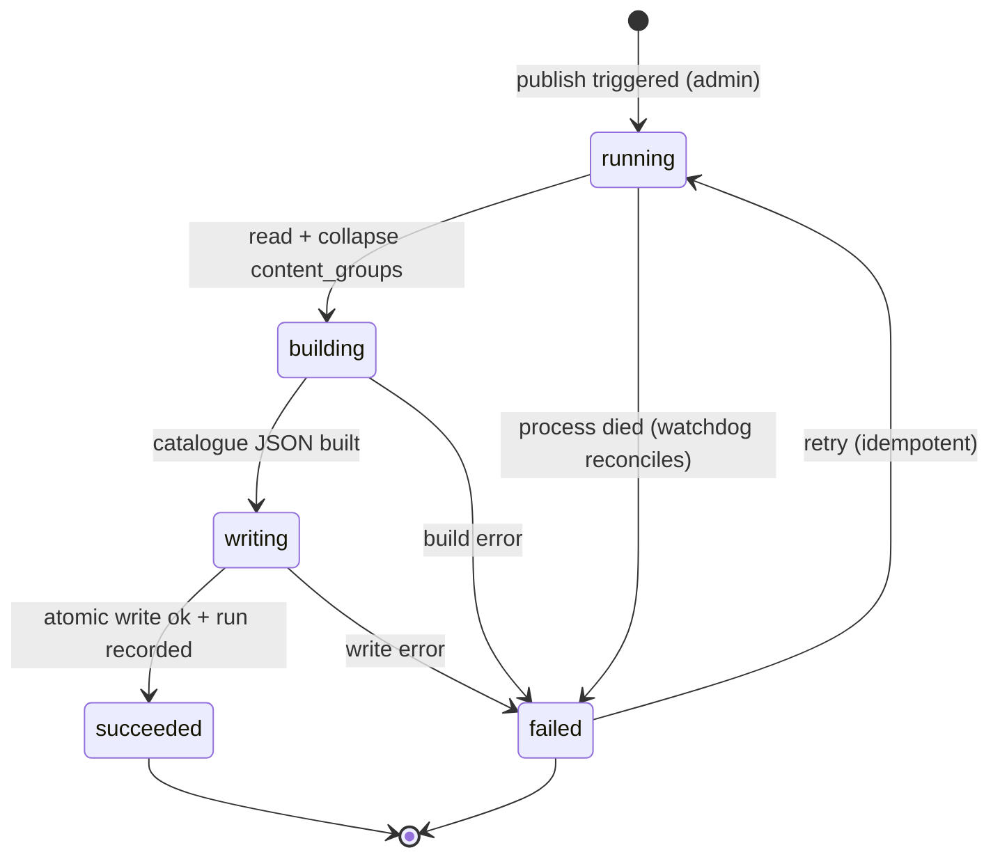
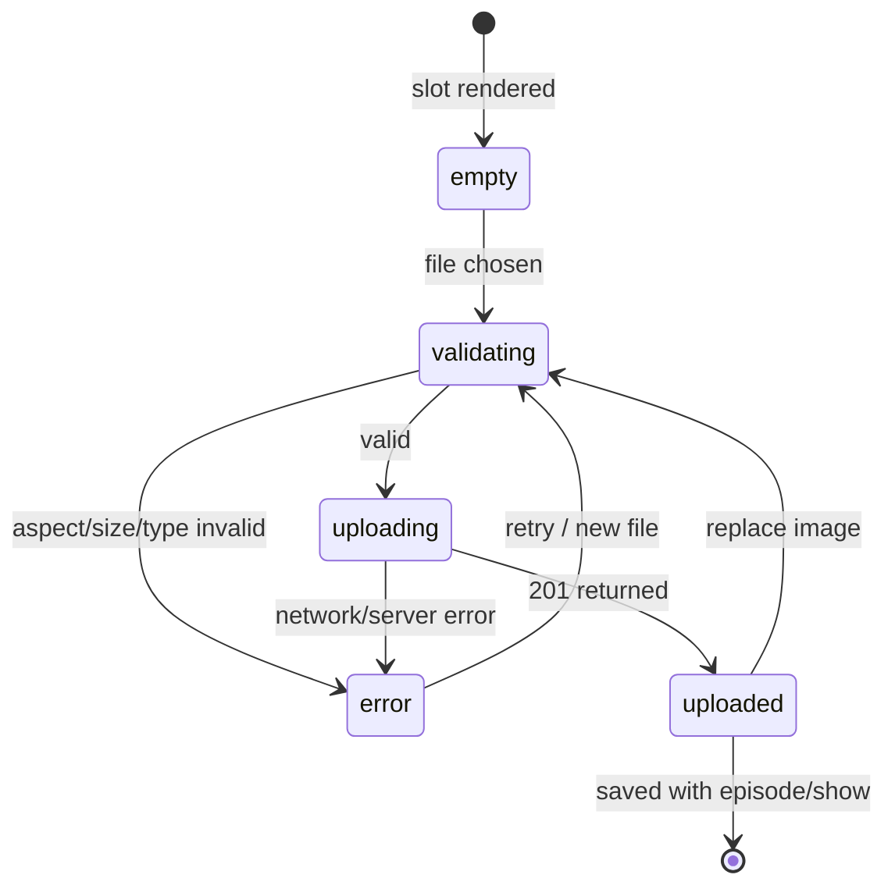

# State Diagrams

## Content status lifecycle (show & episode)

```mermaid
stateDiagram-v2
    [*] --> draft : created
    draft --> draft : edited
    draft --> published : validation passes<br/>(show: has section / episode: artwork + duration)
    published --> draft : unpublished
    published --> published : re-published
    published --> [*] : deleted
    draft --> [*] : deleted
```

## Publish run lifecycle

```mermaid
stateDiagram-v2
    [*] --> running : publish triggered (admin)
    running --> building : read + collapse content_groups
    building --> writing : catalogue JSON built
    writing --> succeeded : atomic write ok + run recorded
    writing --> failed : write error
    building --> failed : build error
    running --> failed : process died (watchdog reconciles)
    succeeded --> [*]
    failed --> [*]
    failed --> running : retry (idempotent)
```

## Artwork upload state (per slot in the CMS)

```mermaid
stateDiagram-v2
    [*] --> empty : slot rendered
    empty --> validating : file chosen
    validating --> error : aspect/size/type invalid
    validating --> uploading : valid
    uploading --> uploaded : 201 returned
    uploading --> error : network/server error
    error --> validating : retry / new file
    uploaded --> validating : replace image
    uploaded --> [*] : saved with episode/show
```
