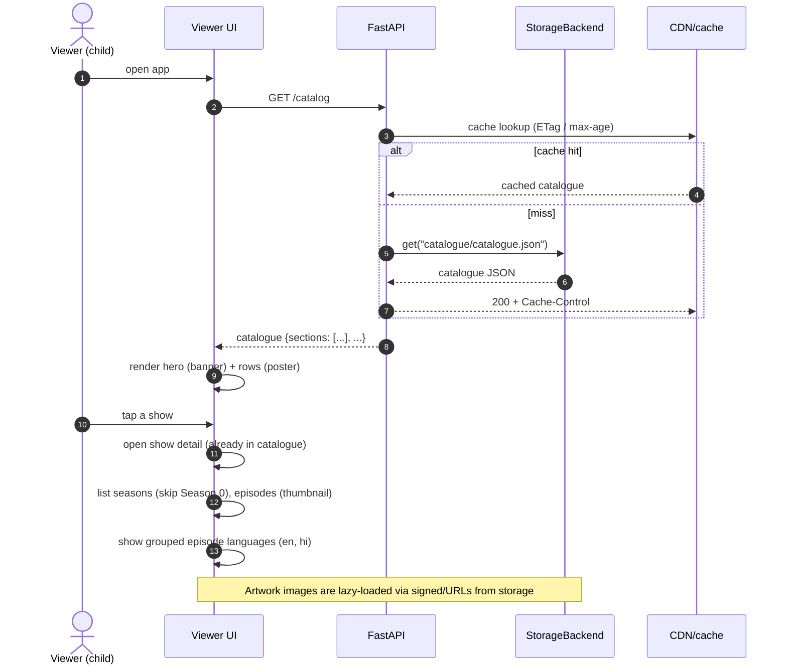

# Sequence — Viewer Catalogue Browse

The viewer talks **only** to read-only catalogue endpoints. No admin endpoints, no auth.

## Design notes

- The catalogue is a **single document**; the viewer renders locally and never queries the DB.
- Artwork **URLs** are embedded in the catalogue; images load lazily with blur-up placeholders so the
  UI stays pleasant on slow networks.
- `Season 0` is filtered out client-side (and omitted from the catalogue's season list) so trailers
  never appear as a normal season.
