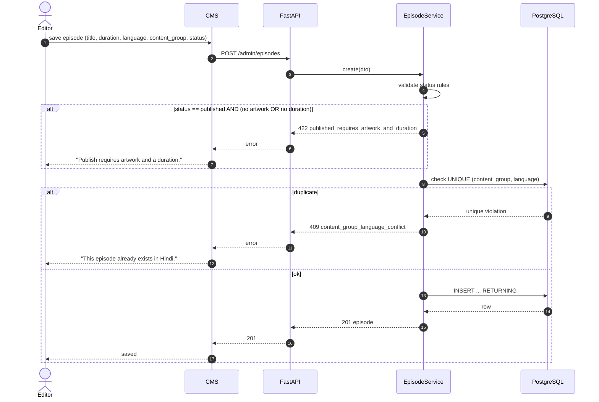
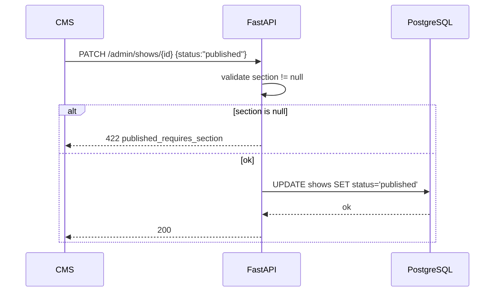

# Sequence — CRUD with Validation

Creating/updating an episode exercises three invariants. Shows and seasons follow the same pattern.

## Show-level rule

When publishing a **show**, `section` must be set:

