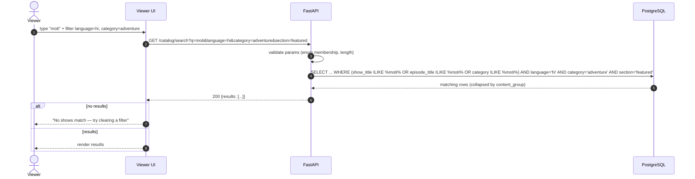

# Sequence — Search & Filters

## Implementation & scale

- **V1:** SQL `ILIKE` over `shows.title`, `episodes.title`, and category, with all filters composed
  via SQL `AND`. Correct for the seed's ~95 episodes and fine well into the thousands.
- **When it stops working:** `ILIKE %…%` cannot use a B-tree index, so latency grows linearly. It
  becomes inadequate around tens of thousands of rows / sustained query load.
- **What next (documented, not built):** add PostgreSQL full-text search (`tsvector` + GIN index) for
  `q`, and materialise the catalogue into a search index (or offload to a dedicated search engine)
  once the catalogue is large or latency-sensitive. Filters remain ordinary indexed columns.
