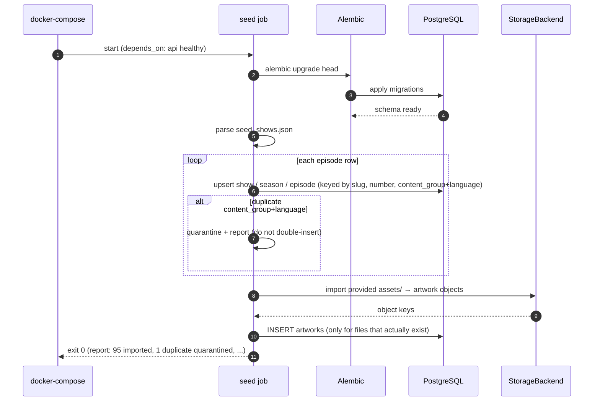

# Sequence — Seed / Migration

`docker-compose up` runs a one-shot seed job after migrations, loading `seed_shows.json`.

## Idempotency

The seed job is **idempotent**: upserts keyed on natural keys (slug; season number; content_group +
language), so re-running `docker-compose up` doesn't duplicate data. Duplicate `(content_group,
language)` rows are quarantined with a logged report rather than crashing the whole import.
