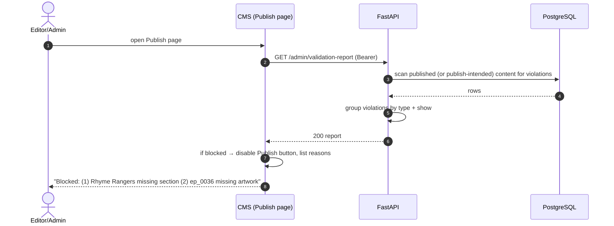

# Sequence — Validation Report



## Report shape

```json
{
  "publishable": false,
  "blocking": [
    {
      "type": "show_missing_section",
      "show": "Rhyme Rangers",
      "count": 1
    },
    {
      "type": "episode_missing_artwork",
      "show": "Discover India with Moti",
      "episode": "ep_0036",
      "count": 1
    }
  ],
  "warnings": [
    {
      "type": "duplicate_content_group_language",
      "content_group": "motis-many-lives-s01e02",
      "language": "hi",
      "episodes": ["ep_0004", "ep_9001"]
    }
  ]
}
```

Grouping lets an editor fix issues **without asking an engineer** — the exact requirement.
